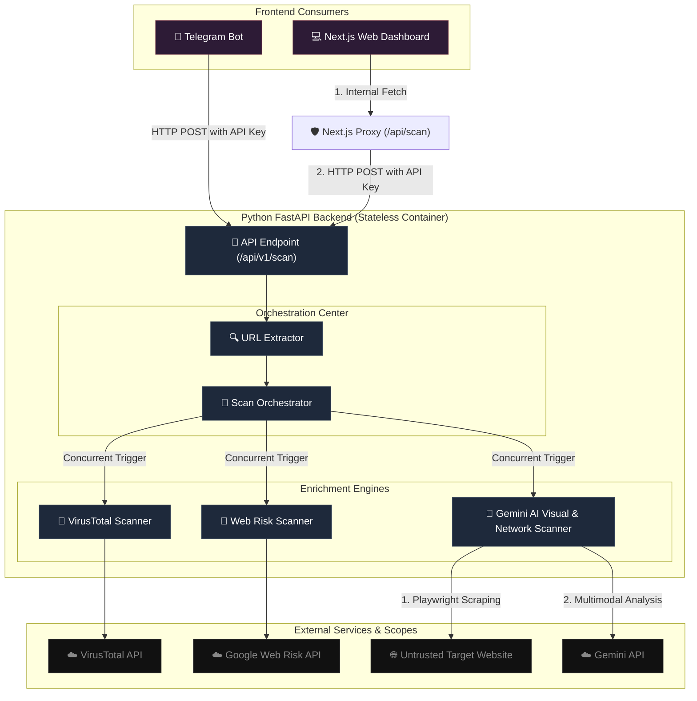

# 🏗️ Architecture Design (Project Mata-Mata)

**Project Mata-Mata** is an AI-Native unified phishing detection and web analysis engine. It moves away from monolithic scripts into a API-first, serverless-capable monorepo.

---

## 📈 High-Level Visual Flow



---

## 🏢 Component Layout

### 1. `backend/api/` (The Presentation Layer)
- Driven by `FastAPI`.
- Exposes `POST /api/v1/scan` to external clients. 
- Stateless and strictly listens to container `$PORT`.

### 2. `backend/core/` (The Heavy Business Engine)
- **`orchestrator.py`**: Manages the multi-processing threads and captures responses. If Google Web Risk surfaces a deterministic "High Threat" early, the Orchestrator safely cancels the Playwright render to conserve API credits.
- **`scanners.py`**: Wrappers for VirusTotal static vendor checks, thresholds, and Google Threat Intelligence (GTI) heuristics. (Note: Supports fallback to standard VT scoring if the API key lacks GTI access; requires `x-tool: project-mata-mata` header for tracking).
- **`ai_phishing_detector.py`**: Spawns independent unshielded headless instances to grab screenshot binary streams + intercept in-line Javascript payload dumps. This payload is shipped straight to **Gemini 2.5 Multi-Modal API** for context inference.

### 3. `clients/telegram_bot/` (The Conversational Consumer)
- Decoupled `python-telegram-bot` script listening to messages and defanging standalone IP addresses.
- It doesn't run Python `playwright` directly—it just queries the centralized FastAPI `Scan Orchestrator`, takes the JSON results, and formats them back into Telegram HTML cards.

### 4. `clients/web_frontend/` (The Unified UI Dashboard)
- A highly stylized Dark-mode Single Page Application targeting Next.js React libraries.
- Features neon threat indicators, a radar spinner, and beautiful tabular drill-downs of the scanner JSON outputs.
- **BFF Proxy**: Includes a server-side API route (`app/api/scan/route.ts`) that acts as a secure Backend-for-Frontend proxy, protecting the master `MATA_API_KEY` from being exposed to the browser.

---

## ⚖️ Scoring Logic & Final Verdict

The `Orchestrator` computes a unified final verdict (`DANGER`, `WARNING`, `SAFE`) based on a compound priority logic that requires corroboration for high-severity flags:

- **🔴 DANGER**: Requires at least one **Core Intel** indicator AND at least one **Verification** indicator to be true.
  - *Core Intel*: Google TI (`gti_score > 60` or `gti_verdict` is malicious) OR Web Risk flags it as malicious.
  - *Verification*: AI Analysis identifies it as high risk OR VirusTotal detections breach the threshold (`> 5`).
- **🟢 SAFE**: Requires a clean indicator AND no active community detections.
  - *Conditions*: (`gti_verdict` is benign OR Web Risk module flags it as safe) **AND** VirusTotal must have exactly `0` detections.
- **🟡 WARNING**: The fallback state for any link failing both tests above. It implies that at least one engine raised a suspicion but it lacked sufficient corroboration to be marked as `DANGER`.

---

## 🛰️ Lifecycle Sequences 

> [!NOTE]
> The lifecycle of a scan looks like this:

1. **Submit**: Client ships URL to FastAPI.
2. **Normalize**: Backend normalizes query (stripping hex, un-obfuscating defanged URL links).
3. **Dispatch**: Concurrent execution across VT, Web Risk, and Playwright Scrapers.
4. **Scraping (Heavy)**: If using Playwright, a hidden chromium tab renders the exact site the victim sees, grabbing outbound `POST`/`PUT`/`PATCH` telemetry drops.
5. **AI Evaluation**: Screenshot is combined with isolated inline code strings and examined by Gemini.
6. **Output**: The finalized JSON response merges (Visual Scores + Threat Intel Scores) back to the UI.

---

## 🔄 DevOps & Deployment Flow (CI/CD)

The project uses Infrastructure-as-Code (IaC) via **Terraform** and automated deliveries via **Google Cloud Build 2nd Generation Triggers**.

```mermaid
graph LR
    Dev["💻 Developer (Git Push)"]
    GitHub["🐙 GitHub Repo (Main Branch)"]
    CB["☁️ Cloud Build Trigger"]
    AR["📦 Artifact Registry"]
    CR["🚢 Cloud Run (asia-southeast1)"]

    Dev -->|Push| GitHub
    GitHub -->|Webhook (2nd Gen)| CB
    CB -->|1. Docker Build| CB
    CB -->|2. Push Container| AR
    CB -->|3. Deploy| CR
```

### Key DevOps Components:
- **`terraform/`**: Defines the State machine for Cloud Run instances, Artifact Registry pools, and Secret Manager binds.
- **`push_secrets.sh`**: A lightweight script to replicate local `.env` values into Secret Manager so Terraform doesn't have to manage unencrypted keys.
- **`cloudbuild.yaml`** (Folders: `backend/`, `clients/*`): Standalone manifests instructing GCP Cloud Build how to compile specific context modules automatically.
